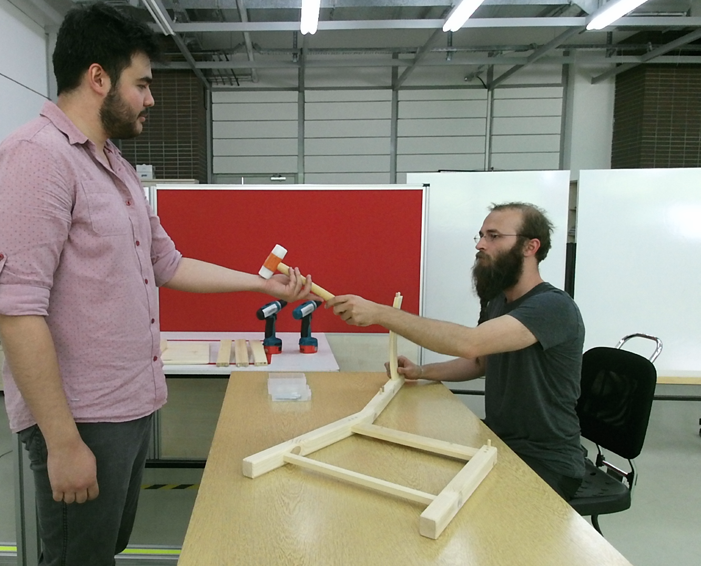

This is the webpage for the project KALFA (New Methods for Assembly Scenarios with Collaborative Robots).

  <nav class="stroke">
    <ul>
      <li><a class="aS" href="#wik">What is KALFA?</a></li>
      <li><a class="aS" href="#summary">Summary</a></li>
      <li><a class="aS" href="#objectives">Objectives</a></li>
      <li><a class="aS" href="#publications">Publications</a></li>
      <li><a class="aS" href="#contact">Contact</a></li>
    </ul>
  </nav>

------

    

-----
### <tag id="wik">What is KALFA?</tag>

KALFA is a project supported by [TUBITAK](http://tubitak.gov.tr/) as a three-year project (2020-2023) for developing collaborative robotic manipulators that can function as a helper to human workers on factory assembly lines. The project is being conducted at [KOVAN Research Lab, Dept. of Computer Eng., METU](kovan.ceng.metu.edu.tr) in collaboration with [Affective Intelligence & Robotics Lab, Dept. of Computer Science and Techn., University of Cambridge](https://www.cl.cam.ac.uk/~hg410/people.html).

| <!-- -->      | <!-- --> |
| ------------- | -------- |
| Project No    | 120E269     |
| Project Type | [ARDEB-1001](https://www.tubitak.gov.tr/tr/destekler/akademik/ulusal-destek-programlari/icerik-1001-bilimsel-ve-teknolojik-arastirma-projelerini-destekleme-pr) | 
| Budget          | ~ TRY 700K (~ $ 90K) |
| Coordinator | [Erol Sahin](http://www.kovan.ceng.metu.edu.tr/~erol/Home.html) [KOVAN Research Lab, Dept. of Computer Eng., METU]     |
| Researchers | [Sinan Kalkan](http://kovan.ceng.metu.edu.tr/~sinan/) [KOVAN Research Lab, Dept. of Computer Eng., METU] and [Hatice Gunes](https://www.cl.cam.ac.uk/~hg410/) [Affective Intelligence & Robotics Lab, Dept. of Computer Science and Techn., University of Cambridge] |
| Students    | Ozgur Aslan, Batuhan Bal, Burak Bolat, Tugba Tumer   |

### <tag id="summary">Summary</tag> 

Collaborative robotic manipulators (Cobots) are the new generation of robots that are designed to work safely in the same environment with humans. These robots, which are expected to take industrial automation to the next level, are expected to increase production efficiency while working in direct contact and collaboration with people, unlike conventional industrial robotic manipulators working in safety cages isolated from humans. The world-wide Cobot market size is projected to grow 5 times between 2020 and 2025 (Statista, 2020).

    
    

In addition to working with workers for long periods of time at big industrial assembly lines, Cobots are expected to take part in frequently changing tasks, mainly in medium and small businesses. In this context, the KALFA project aims to develop artificial intelligence methods that will facilitate the use of Cobots in assembly scenarios, and human-robot interaction (IRE) capabilities that will support these robots to work in harmony and efficiently with workers.

The proposed project has been defined as the continuation of the “ÇIRAK: Compatible robotic manipulator support for assembly workers” project. In the ÇIRAK project, which aims to “develop a robot manipulator system that will provide the parts and tools needed by the worker during assembly, and return the ones that are no longer needed to their places”, for an assembly task whose plan is known by the robot, (i) representation of the assembly plan and the diary, (ii) perception of the human coworker, object parts and the tools, and (iii) detection of whether the ongoing assembly conforms to the plan or whether there is any error.

    
    

### <tag id=objectives>Objectives</tag> 

The KALFA project will focus on three main issues for Cobots to be used more easily in assembly scenarios and to support more harmonious and efficient interaction with the worker they work with:

*	Automatic construction (learning) of the assembly plan according to the target product: In the ÇIRAK project, a precise assembly plan was manually prepared for step-by-step execution of actions, which included the parts, the tools and which tools should be used on what parts etc. The KALFA Project proposes to learn the assembly plan using Deep Reinforced Learning by interacting with the parts and the tools within the Cobot's simulation environment, thus facilitating the use of Cobot in assembly scenarios by people with low technical skills.

* Determining the sources of the errors using a causality model: ÇIRAK project and similar studies can detect an error during the installation by comparing the current situation with the previously defined plan, but cannot determine the source of the errors or determine the steps that should be taken in order not to repeat the errors. The KALFA Project proposes to learn a causal model in the simulation environment from interplay between parts, tools, factors and assembly stages, and to use this causal model to determine the sources of errors when an anomaly is detected.

* Improving non-verbal human-robot interaction (HRI) capabilities in Cobots: In the ÇIRAK project it was shown that applying some of Disney's animation principles to a Cobot improves the quality of HRI. The KALFA project will advance these proof-of-concept works in three directions to develop a full non-verbal communication ability in Cobots: (1) After evaluating how all of Disney's animation principles can be applied to improve the quality of HRI, these principles will be formally defined and integrated into cobots as parameterized “HRI filters”. (2) Methods for detecting non-verbal communication clues of the workers in the assembly scenarios will be developed. (3) Non-verbal communication cues from workers will be associated with HRI-filters in order to increase the harmony between Kobot and the worker. The effects of these methods on the quality of HRI will be measured by human-robot experiments.

### <tag id=publications>Publications</tag> 

The list of publications (from KALFA and its precursor CIRAK project):

* Kalkan, S., Terzioğlu, Y., Aslan, Ö., Bolat, B., Bal, B., Tümer, T., Kurnaz, F.C., Şahin, E. (2021). ICRA 2021 Workshop on Unlocking the Potential of HRC for Industrial Applications. [[PDF]](http://kovan.ceng.metu.edu.tr/~sinan/Terzioglu_ICRA2021WS.pdf), [[Video]](#yunus_vid)
* Özcan, A. M., Acartürk, C., Şahin, E. (2021). ICRA 2021 Workshop on Unlocking the Potential of HRC for Industrial Applications. [[PDF]](https://collaborate-project.eu/wp-content/uploads/2021/05/10.-Ahmet-Ozcan-O%CC%88zcan_URTrust_Paper.pdf?6bfec1&6bfec1), [[Video]](#meric_vid)
* Terzioğlu, Y., Mutlu, B., & Şahin, E. (2020). Designing social cues for collaborative robots: the role of gaze and breathing in human-robot collaboration. In Proceedings of the 2020 ACM/IEEE International Conference on Human-Robot Interaction (pp. 343-357). [[PDF]](http://dl.acm.org/doi/abs/10.1145/3319502.3374829).
* Kurnaz, F. C., Hocaog̃lu, B., Yılmaz, M. K., Sülo, İ., & Kalkan, S. (2020). ALET (Automated Labeling of Equipment and Tools): A Dataset for Tool Detection and Human Worker Safety Detection. In European Conference on Computer Vision Workshop on Assistive Computer Vision and Robotics (pp. 371-386). [[Code and dataset]](https://github.com/metu-kovan/METU-ALET), [[PDF]](https://arxiv.org/abs/1910.11713).

<figure id="yunus_vid">
    
    <video class="center" controls="true" allowfullscreen="true" poster="path/to/poster_image.png">
        <source src="./visuals/9.-Yunus-Terzioglu-Terzioglu.mp4" type="video/mp4">
    </video>
</figure>

<figure id="meric_vid">
    
    <video class="center" controls="true" allowfullscreen="true" poster="path/to/poster_image.png">
        <source src="./visuals/10.-Ahmet-Ozcan-Özcan.mp4" type="video/mp4">
    </video>
</figure>

<!--  -->

<!--img src="./visuals/appealNoAppeal-final.jpg" alt="drawing"/-->

### <tag id=contact>Contact</tag> 

Please use the following email address for course related issues: metu-kalfa [@] googlegroups [dot] com
